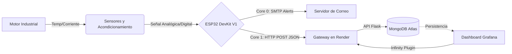

# Industrial Motor Monitoring System (IMMS)


> **Despliegue en Vivo:** https://iotadvancedprgm-2.onrender.com

---

## Descripción General

Este proyecto implementa un ecosistema **AIoT (Artificial Intelligence of Things)** modular y escalable diseñado para el monitoreo en tiempo real de variables críticas (temperatura y corriente) en motores industriales.  
Reemplaza soluciones SCADA propietarias mediante una arquitectura *cloud-native* basada completamente en tecnologías abiertas.

El flujo de datos abarca desde la adquisición física mediante acondicionamiento de señales Edge hasta el procesamiento, almacenamiento y visualización en la nube usando **Docker, Flask, MongoDB y Grafana** desplegados en **Render**.

---

## Arquitectura del Sistema

La solución consta de tres capas principales:

- **Edge (Hardware/Firmware)**
- **Cloud (Backend/Base de Datos)**
- **Aplicación (Dashboard en Grafana)**



---

## Ingeniería de Hardware

### Circuito de Acondicionamiento para SCT-013

1. **Suelo Virtual (1.65V)**
   - Divisor resistivo (R1 = R2).
   - Amplificador operacional como seguidor (buffer).

2. **Filtrado y Conversión**
   - Resistencia de carga de 33 ohm.
   - Capacitor de acople AC de 10uF.

3. **Amplificación con Op-Amp**
   - Configuración no inversora con ganancia:  
     \
     \(G = 1 + rac{100k\Omega}{10k\Omega} pprox 11\)

### Sensor de Temperatura DS18B20

- Protocolo digital 1-Wire.
- Resistencia pull-up de 4.7kohm.
- Rango operativo: -55°C a 125°C.

---

##Firmware (ESP32 + FreeRTOS)

| Núcleo | Tarea | Descripción |
|--------|--------|-------------|
| Core 0 | **emailTask** | Envío de alertas SMTP con SSL/TLS |
| Core 1 | **sensorAndFlaskTask** | Lectura ADC, RMS, lógica de umbral y HTTP POST |

Características del firmware:

- Uso de **mutex** para variables compartidas.  
- **Queues** para comunicación entre tareas.  
- Factor de calibración ajustado: **5.51**.

---

## Backend y Cloud

### API (Flask)
- Endpoint principal: `/receive_sensor_data` (POST).
- Compatible con el plugin **Infinity** de Grafana.

### Base de Datos: MongoDB Atlas
- Colección principal: `SensorsReaders`.

### Dashboard en Grafana
- Visualización en tiempo real e históricos.
- Paneles con gauge, series temporales y estadísticas.

  

---

## Instalación y Despliegue

### 1. Entorno Local con Docker

```bash
git clone https://github.com/tu-usuario/iot-motor-monitor.git
cd iot-motor-monitor
docker-compose up --build
```

Servicios locales:

- API Flask en http://localhost:5001  
- Grafana en http://localhost:3000  
- Mongo Express en http://localhost:8081  

### 2. Configuración del Firmware (PlatformIO)

```cpp
const char* ssid = "TU_WIFI";
const char* password = "TU_PASSWORD";
const char* serverUrl = "https://tu-deploy-en-render.com/receive_sensor_data";
```

---

## Endpoints de la API

| M茅todo | Endpoint | Descripción |
|--------|----------|-------------|
| **POST** | `/receive_sensor_data` | Recibe telemetría de sensores |
| **GET** | `/infinity_query` | Datos planos JSON para Grafana |
| **GET** | `/dashboard` | Visualización web integrada |

---

## Conclusiones

1. Arquitectura robusta y de bajo costo.  
2. Base salida para mantenimiento predictivo mediante series temporales.  
3. Escalable gracias a contenedores y despliegue cloud Native.

---

## Autor

**Ing. Karolin Jaramillo Grisales --- Santiago Montoya Restrepo**  
IoT Solutions Architect & Embedded Systems Developer
