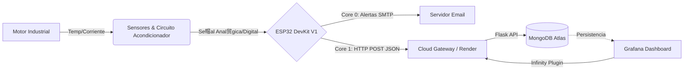

# Industrial Motor Monitoring System (IMMS)

     

> **Live Deployment:** https://iotadvancedprgm-2.onrender.com

## 馃摉 Descripci贸n General

Este proyecto implementa un ecosistema **AIoT (Artificial Intelligence of Things)** modular y escalable dise帽ado para el monitoreo en tiempo real de variables cr铆ticas (Temperatura y Corriente) en motores industriales. El sistema sustituye soluciones SCADA propietarias por una arquitectura *cloud-native* basada en c贸digo abierto.

---

## 馃彈 Arquitectura del Sistema

La soluci贸n sigue una arquitectura de tres capas: **Edge (Hardware/Firmware), Cloud (Backend/DB) y Aplicaci贸n (Dashboard).**



### 馃攲 Ingenier铆a de Hardware

#### Circuito de Acondicionamiento de Se帽al (SCT-013)

1. **Suelo Virtual (1.65V)**  
   - Divisor resistivo (R1 = R2).  
   - Buffer Op-Amp como seguidor.

2. **Filtrado y Conversi贸n**  
   - Resistencia de carga 33惟.  
   - Capacitor AC 10碌F.

3. **Amplificaci贸n (Op-Amp 2)**  
   - Ganancia:  
     \
     \(G = 1 + rac{100k}{10k} pprox 11\)

#### Sensor de Temperatura (DS18B20)
- Protocolo 1-Wire.
- Pull-up 4.7k惟.
- Rango -55掳C a 125掳C.

---

## 馃捇 Firmware (ESP32 / FreeRTOS)

| N煤cleo | Tarea | Descripci贸n |
|-------|--------|-------------|
| Core 0 | emailTask | Env铆o SMTP con SSL/TLS |
| Core 1 | sensorAndFlaskTask | Muestreo ADC, RMS, HTTP POST |

Caracter铆sticas:
- Sem谩foros (mutex) para variables compartidas.  
- Queues para pasar alertas entre tareas.  
- Calibraci贸n por software (factor 5.51).

---

## 鈽侊笍 Backend & Cloud

### API (Flask)
- `/receive_sensor_data` (POST).  
- Compatible con plugin Infinity de Grafana.

### MongoDB Atlas
- Colecci贸n: `SensorsReaders`.

### Grafana
- Dashboards hist贸ricos y en tiempo real.

---

## 馃殌 Instalaci贸n y Despliegue

### 1. Local (Docker)

```bash
git clone https://github.com/tu-usuario/iot-motor-monitor.git
cd iot-motor-monitor
docker-compose up --build
```

Servicios:
- API: http://localhost:5001  
- Grafana: http://localhost:3000  
- Mongo Express: http://localhost:8081  

### 2. Firmware (PlatformIO)

```cpp
const char* ssid = "TU_WIFI";
const char* password = "TU_PASSWORD";
const char* serverUrl = "https://tu-deploy-en-render.com/receive_sensor_data";
```

---

## 馃搳 Endpoints

| M茅todo | Endpoint | Descripci贸n |
|--------|----------|-------------|
| POST | `/receive_sensor_data` | Recibe telemetr铆a |
| GET | `/infinity_query` | Datos planos para Grafana |
| GET | `/dashboard` | Dashboard embebido |

---

## 馃幆 Conclusiones

1. Sistema econ贸mico y robusto.  
2. Base para mantenimiento predictivo.  
3. Arquitectura escalable cloud-native.

Autor: **Ing. [Tu Nombre]**  
IoT Solutions Architect & Embedded Systems Developer
